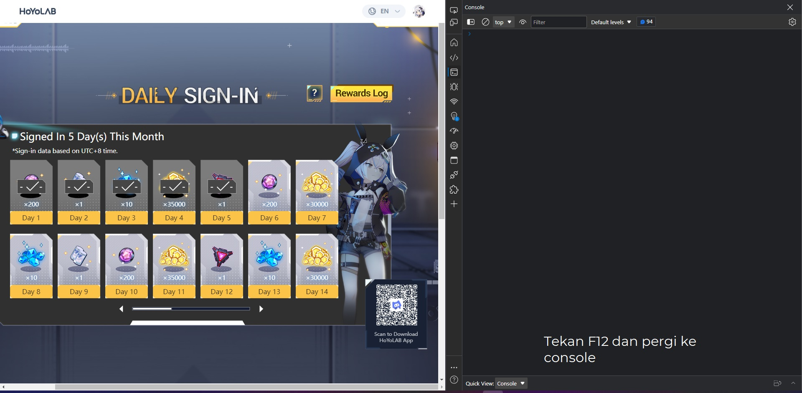
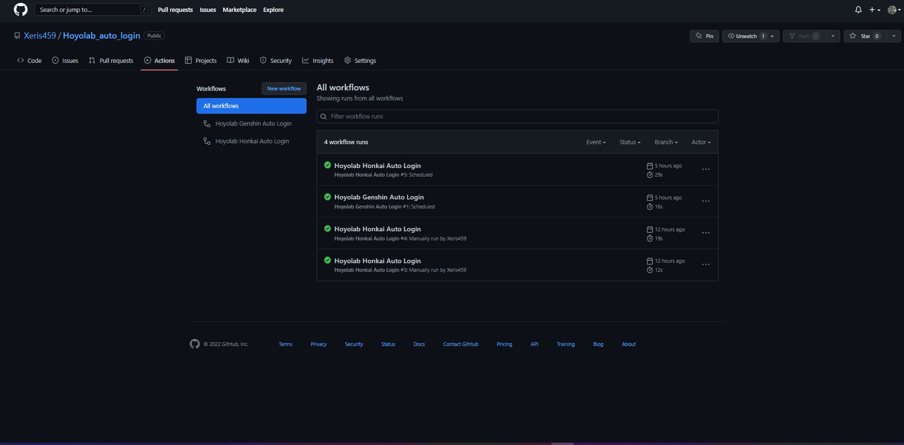
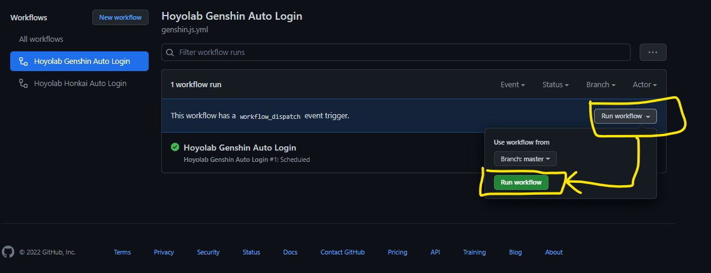

## Hoyolab Auto Log-in

### _tool ini berfungsi untuk log-in hoyolab untuk game keluaran dari mihoyo a.k.a Hoyoverse, script ini dibangun berdasarkan repo github [Genshin Automation](https://github.com/Sergiy3013/genshin_automation)_

> menggunakan tools ini **resiko di tanggung sendiri**. _pembuat tools ini tidak menyimpan data cookie kalian sama sekali_


## Cara menggunakannya

1. fork repository ini
2. dapatkan cookie hoyolab (hanya perlu _ltoken_ dan _ltuid_)
 
    <details>
    <summary>Cara Mendapatkan _ltoken_ dan _ltuid_</summary>

    1. buka browser

    2. masuk ke [hoyolab](https://hoyolab.com)

    3. tekan f12 lalu masuk ke tab console

        

    4. copy lalu pastekan code dibawah ini di console lalu tekan enter
        ``` JS
        var cookie=start();
        var ask=confirm('Cookie: '+cookie+'\n\nClick confirm to copy Cookie.');if(ask==true){copy(cookie);msg=cookie}else{msg='Cancel'}
        function start() {
            return "ltoken=" + getCookie("ltoken") + ";ltuid=" + getCookie("ltuid") + ";";
            function getCookie(name) {
                const value = ";" + document.cookie;
                const parts = value.split("; " + name + "=");
                if (parts.length === 2) return parts.pop().split(';').shift();
            }
        }
        ```
    5. simpan ltoken dan ltuid di tempat yang aman
    </details>
 
 4. atur variabel pada github.
 
    <details>
    <summary>Cara Arur Variabel pada Github</summary>

    1. masuk ke github

    2. pergi ke repository kamu yang hasil fork dari repository ini

    3. masuk ke halaman setting variabel dengan cara pergi ke **_Setting -> Secrets -> Actions_**

    4. buat variabel baru dengan klik **_new repository secret_**

    5. pada input Name masukan **_HOYOLAB_COOKIE_**

    6. pada input secret masukan token yang sudah di dapat tadi
    
        ``` JS
        contoh: 

        ltoken=s**************************************q;ltuid=2******5;
        ```
    </details>
 
 5. tambahkan github action dan jalankan (jangan pilih action yang ingin dijalankan)
 
    <details>
    <summary>Cara menjalankan tools Hoyolab Auto Login</summary>

    1. masuk ke github

    2. pergi ke repository kamu yang hasil fork dari repository ini

    3. masuk ke tab **_Actions_**

    4. pada tab **_Actions_** akan ada beberapa _workflow_
        

        pada gambar di atas terdapat 2 workflow yaitu:
        **Hoyolab Genshin Auto Login** dan **Hoyolab Honkai Auto Login**

    5. masuk ke tab **Hoyolab Genshin Auto Login** atau **Hoyolab Honkai Auto Login** sesuai yang ingin dijalankan fungsi auto loginnya

    6. click **_run workflow_** lalu tekan **_run workflow_** sesuai gambar dibawah ini
        
    
    7. tunggu beberapa saat hingga github selesai menyalakan _workflow_ tersebut

    8. selamat tools sudah aktif dan bisa mendapatkan semua reward pada hoyolab daily signin sesuai dengan game yang anda mainkan
    </details>

:bangbang: Anda harus memperbarui Github Action Setiap 35 hari
## Hoyolab Daily Check-in Support
| Nama Game | Status | Test |
|--|--|--|
| Genshin Impact |:white_check_mark: | Success |
| Honkai Impact 3rd | :white_check_mark: | Success |
| Tears of Themis | :white_check_mark: | Not tested |
| Honkai: Star Rail | :x: | Game Belum Rilis |
| Zenles Zone Zero | :x: | Game Belum Rilis |
| Gun Girl Z | :hammer::moyai: | Game Coid di global dan sea |
